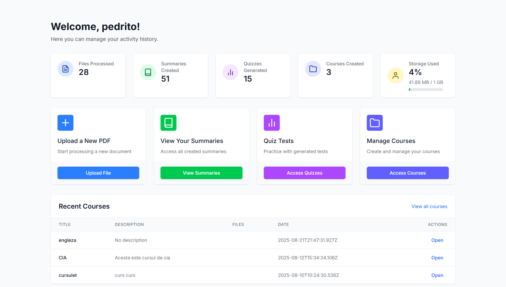

# PDF Resumer

PDF Resumer is an AI-powered web application that generates summaries and study questions from PDF documents.

The goal of the project is to help students quickly understand long documents and test their knowledge using AI-generated summaries and questions.

## Features

* Upload PDF documents
* Extract text from PDFs
* Generate AI summaries
* Generate questions for self-evaluation
* User authentication
* Dashboard for managing uploaded documents

## Demo

Live demo:
https://pdf-resumer-eta.vercel.app

## Screenshots

### Dashboard



### Upload PDF


## Tech Stack

Frontend

* React
* TypeScript

Backend

* Node.js
* Express

AI

* OpenAI API

Infrastructure

* Vercel deployment

## Authentication

Users must create an account and log in to access the dashboard and upload PDF documents.

Authentication is required to use the application.

## Installation

Clone the repository:

```
git clone https://github.com/iPaire/PDF-Resumer.git
cd PDF-Resumer
```

Install dependencies:

Frontend

```
cd client
npm install
npm run dev
```

Backend

```
cd server
npm install
npm run dev
```

## Environment Variables

Create a `.env` file in the server folder:

```
OPENAI_API_KEY=your_openai_api_key
```

## Author

Muntean Pedro
